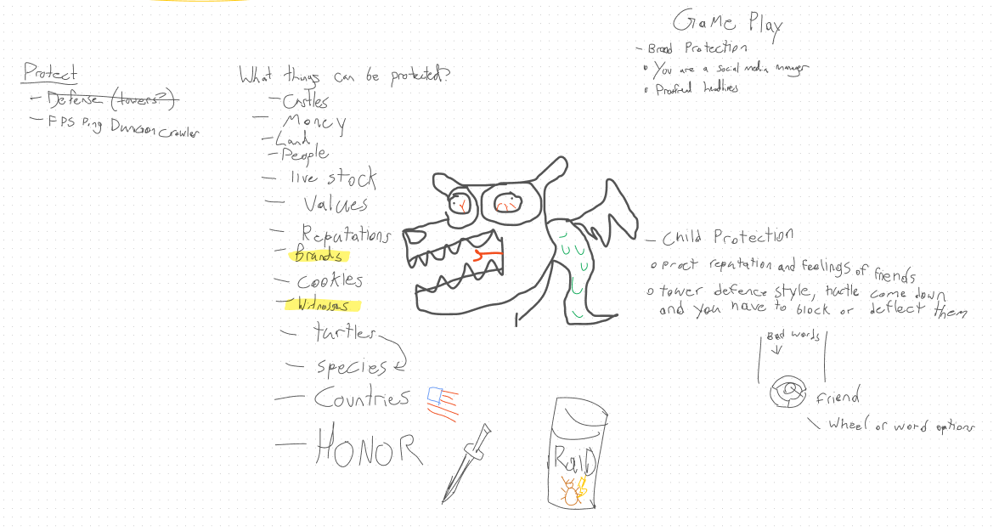
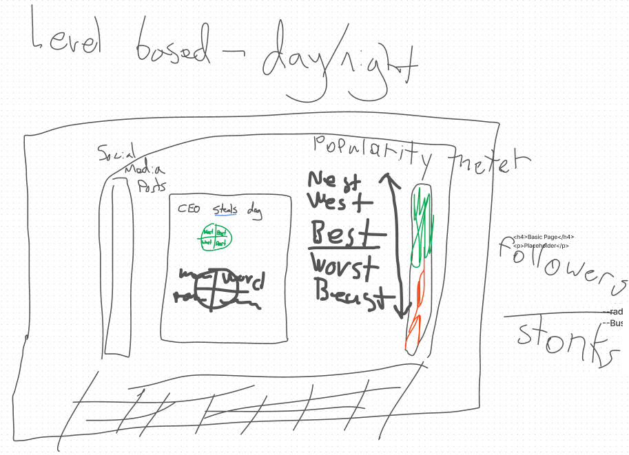

*You can play our entry to the Fireside Game Jam 2022 here: [PR Protector](https://badcop.itch.io/pr-protector). It was rated #1 overall by the judges and other contestants of the jam.*

After taking a break from game development for a while, I decided to enter a game jam with a few friends.
We checked out the [jam calendar on itch.io](https://itch.io/jams) and found a casual looking 10-day jam called [Fireside Jam 2022](https://itch.io/jam/fireside-jam-2022).

The starting day rolled around, and the theme was announced: **Protect.**

# Brainstorming

We created an online whiteboard with Figma Jam, and started drafting ideas (and inevitably, some doodles):

The very first thing that popped into all of our heads was "tower defense". We wrote this down,
and then *immediately crossed it out.* **If an idea is super obvious to you, it's probably super obvious to
other participants too**. If you want to stand out from the crowd, you should try to dig into
the theme a little deeper to find something unique.

One of my favorite brainstorming techniques is to transform the theme into a question: _"What things can be protected?"_

So, we made a list:
 * Castles
 * Money
 * Land
 * People
 * Livestock
 * etc.

About halfway down the list, we wrote 'reputations' and 'brands', which were particularly interesting to me;
I started drafting an idea for a game incorporating these. The basic pitch was along the lines of,
*"what if you work as the social media manager for some large company, and your job is to protect their brand image?"*

We toyed around with a few other ideas, but at the end of our brainstorming session,
decided that this one was the most promising to pursue.

# Solidifying the Idea

From the initial sketch, we knew that this game would take place in a simulated computer desktop environment.
We drafted up a quick inspiration board for ways our game could look:

We decided that the game _[Papers, Please](https://papersplea.se/)_ was similar to what we wanted to create;
in order to not end up with a re-skinned version of that game, we wanted to build a more mini-game style gameplay
loop (think _WarioWare_). We picked a few real-world social media sites to base each of the minigames on:
* **Reddit** - upvoting / downvoting posts related to the brand
* **Twitter** - "cancelling" users with negative opinions on the company
* **Youtube** - filing copyright claims on negative videos
* **Instagram** - photoshopping images
* **News Articles** - filling in the blank to create a headline
    * We ended up de-scoping this one to save time

# Divide and Conquer

Our team consisted of 4 members, divided roughly as:
* 1 artist
* 1 writer
* 2 programmers

We spun up a Google Doc to collaborate on writing the various prompts, and a Google Drive to share art assets.
We also created a private channel in a Discord server so we could communicate asynchronously.

Since building a minigame based game is a fairly tall order,
we set a target deadline of 5 days (half the jam duration) to have a playable demo.

Getting to a playable demo early is key in a game jam; you should be constantly playing your game and iterating on
the main gameplay loop throughout the development process.

# Know Your Audience

The audience of a jam game is different than publishing to a wider audience:
* They're likely fellow game developers
* They're playing a bunch of other submissions

You should design your game to use this as an advantage.

Since time is a very limited resource, you should focus on building a polished, vertical slice of a game.
Ideally, you should aim to have **5-10 minutes worth of gameplay.** Since your audience in a game jam is typically
the other contestants, they will likely only spend a short amount of time on your game before moving on to the next.

Admittedly, we somewhat missed the mark on this; our game's average ended up being around ~25 minutes for completion,
because we under-estimated the difficulty of our game.

## Include a Tutorial

Since your audience is playing a bunch of games, they're not going to be keen to read a giant wall of text on
your game's page before jumping into the gameplay. Ideally, this should be baked into the gameplay of your game.

This can be as simple as putting some text on the walls in the first few levels of your game,
and designing the levels to introduce the mechanics in order while onboarding the player.

For our game, we designed the _first half of the game_ to be a tutorial. We introduce the mini-games one-by-one,
and we bake the introductions into the "story" emails at the start of each level.

The first 3 levels of our game are actually impossible to fail - we added a rubber-banding mechanic to the stock price
so that you can take as long as you like on them.

# Conclusions

This was my 5th time entering a game jam, but my first time working with this particular team.
For each of the other team members, it was their first time participating in a jam.

Because of this, I spent maybe a bit more time wearing the "team lead" hat than I initially intended;
this caused the experience to be a bit more stressful than I would have liked.

However, in the end, I'm fairly happy with the finished product. I think we made a fun game, and I'm
glad other people enjoyed playing it! Thanks to everyone else involved with the jam; it was really fun to check
out all of the other entries and interpretations of the theme. If you're curious, you can see [all of the game
submissions here.](https://itch.io/jam/fireside-jam-2022/results)

Hopefully, I'll be back to participate next year!
