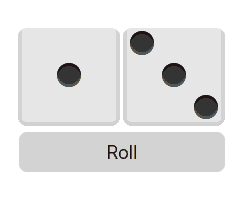

I wanted to add 3D, physics-based dice to my online game, [rolly cubes](https://rollycubes.com).

Synchronizing physics across an online multiplayer game is a non-trival challenge. Generally, it requires running the simulation on an authoritative game server and sending updates to the clients. I tried this approach at first, but I felt I was adding a lot of bloat to my otherwise lightweight server.

I found surprisingly little information for how people approached this particular problem in the past, so I wanted to write this blog post to document my solution in case it's helpful to anyone else.

## Taking A Step Back

My goal was fairly straigtforward: add a 3D dice visualization to the client.

Previously, the the client/server architecture worked like this:
  1. The client sends a request to roll the dice.
  1. The server generates random values and propagates them to all clients.
  1. The client plays a canned animation based on the values from the server.

Put together, it looked like this:

Functional, but definitely not 3D.

I wanted to keep the server logic simple; generate the random values, send them to the client, and let the client worry about simulating the physics. Given this constraint, I needed to build a client that could reliably produce a particular roll.

## Getting Started

Since my game is web-based, I needed to find a 3D library built in JavaScript. After some research, I decided on [Babylon.js](https://www.babylonjs.com/), which comes with compatibility with several different physics engines.

I started by creating a simple set of cubes textured as dice, and connecting them up to a physics engine (I chose [cannon.js](https://schteppe.github.io/cannon.js/)). Here's what the early stages looked like:

## The Difficult Part

The physics worked great, but there was no way to influence what result was shown on the dice. If I could build a system that could reliably roll the same value every time, I would be most of the way there. I came up with the following plan; each time the client received the random values from the server, it would:

  1. [Move the dice](https://github.com/cgsdev0/rollycubes/blob/8d419a12284569f0c40959a4de6482b603ce759a/client/src/3d/main.ts#L384-L388) to the edge of the screen.
  1. Choose some [random impulse values](https://github.com/cgsdev0/rollycubes/blob/8d419a12284569f0c40959a4de6482b603ce759a/client/src/3d/main.ts#L393-L403) to impart on the dice.
  1. **[Run the entire physics simulation in a single frame](https://github.com/cgsdev0/rollycubes/blob/8d419a12284569f0c40959a4de6482b603ce759a/client/src/3d/main.ts#L410-L414),** until the dice stop moving.
    a. [Record each tick](https://github.com/cgsdev0/rollycubes/blob/8d419a12284569f0c40959a4de6482b603ce759a/client/src/3d/main.ts#L436-L447) of the simulation into memory.
  1. [Calculate the upward face](https://github.com/cgsdev0/rollycubes/blob/8d419a12284569f0c40959a4de6482b603ce759a/client/src/3d/main.ts#L24-L45) of the dice.
  1. [Re-map the UVs](https://github.com/cgsdev0/rollycubes/blob/8d419a12284569f0c40959a4de6482b603ce759a/client/src/3d/main.ts#L48-L73) of the dice, then [play back](https://github.com/cgsdev0/rollycubes/blob/8d419a12284569f0c40959a4de6482b603ce759a/client/src/3d/main.ts#L482-L516) the recorded simulation.

All of the code for the 3D simulation lives in [this file](https://github.com/cgsdev0/rollycubes/blob/8d419a12284569f0c40959a4de6482b603ce759a/client/src/3d/main.ts); I apologize for the mess.

With this code done, the final step was to **tweak the UVs of the dice further** before playing the roll, so that I could display the results of the dice on the top faces of the dice. I did this by introducing a variable called `fudge` that would be added to the UV indexes, and shift the rotation by that amount.

## Conclusion

The problem of simulating dice physics doesn't _actually_ require physics synchronization; all you need is to be able to produce the desired dice roll consistently in the client. In my solution, each client will actually see a different physics simulation, but will always see the same result. The secret sauce is **pre-calculating the end result of the simulation**, and then **fudging the texture UVs** to produce the roll you want.

It's theoretically possible to use this solution to display the same simulation to each client as well, by seeding the physics with another random value from the server (and using a deterministic physics engine). This wasn't a design goal for me, though, so I didn't bother.

If you want to see the finished project in action, please check out [rolly cubes](https://github.com/cgsdev0/rollycubes#dice-game)!
