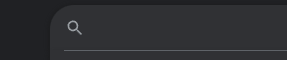

I decided to finally build a new website, using [Hugo][hugo-gh].

I have this tendency to fall down absurd rabbitholes while working on projects like this. In this case, it involved making the [home page](https://sarah.engineer/) of my website contain a (very rough draft of a) **POSIX-like shell**. Check it out if you're a nerd like me! Just press 'enter' on the main page to activate it.

## How it's Built

The crux of this shell is [bash-parser](https://github.com/cgsdev0/bash-parser), a repository I stumbled across on GitHub. It's a javascript library with the capability of translating a string of bash to an AST. It's not _perfect_, and neither is my shell's implementation on top of it; however, I find it works well enough for the basics.

For example, if you wanted to search for any posts mentioning [rolly cubes](https://rollycubes.com/), you could use the following command:
```javascript
find -type f . | xargs cat | grep rolly
```

The purists will say that you should be able to xargs into grep directly, to which I say... you're right; [PRs welcome](https://github.com/cgsdev0/cgsdev0.github.io/blob/17bfe7259db771254cb948fa8464fe35fd5329e1/assets/js/commands.js#L77-L109)!

[hugo-gh]: https://github.com/gohugoio/hugo

## Handling Input

...I'm stubborn. Like, really stubborn. This is how the default input cursor looks in my browser:


Here's how I wanted it to look:


Unfortunately, at the time of writing, there's not great support for CSS for input cursors.

So, what can we do? We can build our own!

Not so fast - building a text input from scratch in JavaScript is ~~difficult~~ _impossible_. Browsers implement a variety of keyboard shortcuts, and they're impossible to hijack universally across all browsers. Instead of starting from scratch, though, we can build a text input in JavaScript using a **real text input** as our base!

I'll spare you all the details for this post, but essentially I accomplished my goal by hijacking an always-focused off-screen text input, and spying on its text + selection state. If you're interested, you can find [the code here](https://github.com/cgsdev0/cgsdev0.github.io/blob/main/assets/js/input.js).

